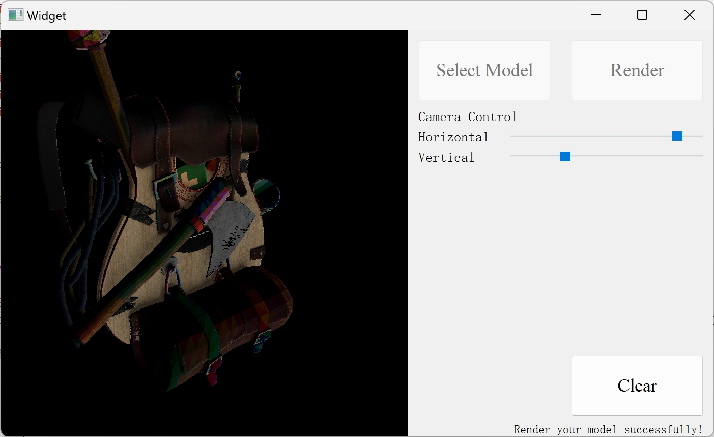
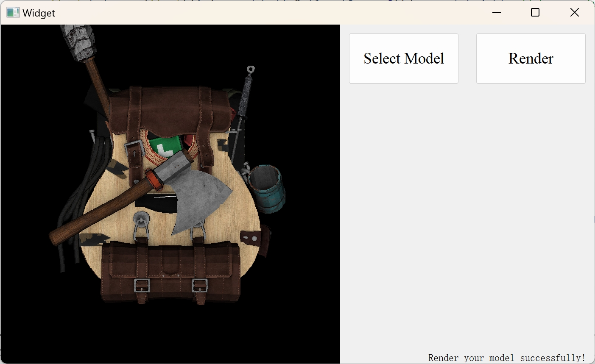
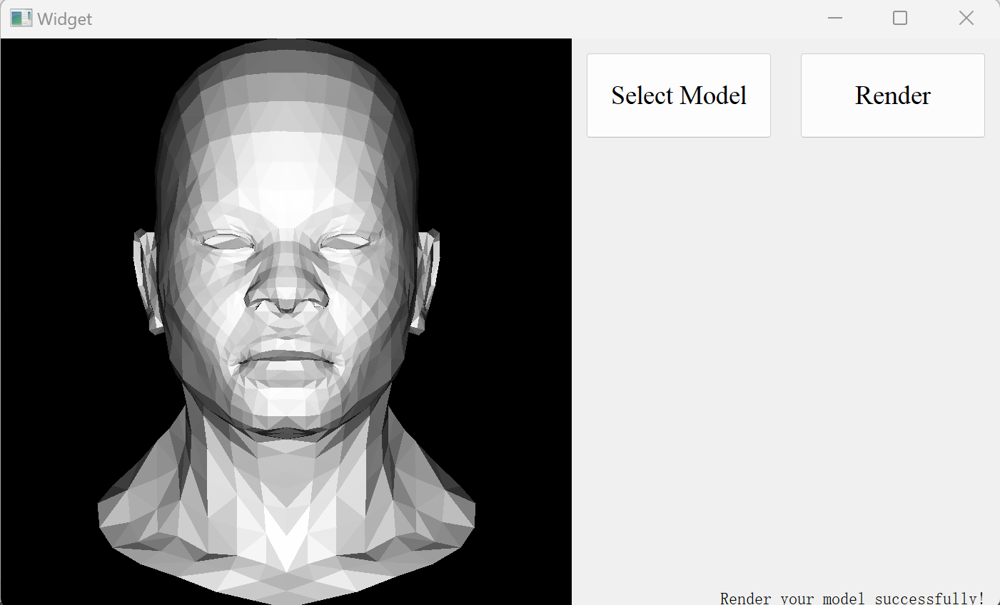
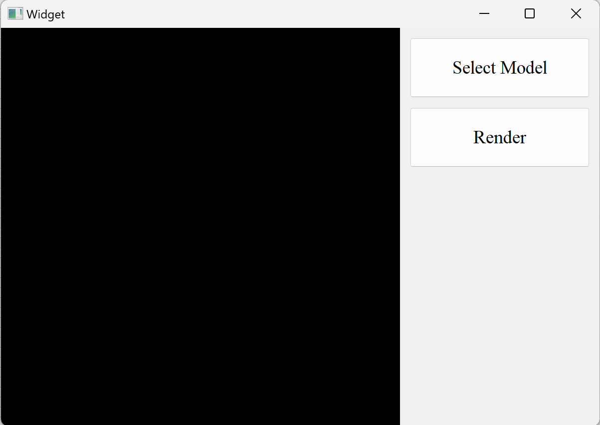

# Beginner Renderer J_Kodak

I will create a simple renderer from zero as a beginner of graphics. The GUI is created using Qt Creator. All updates will be shown in this repository.

------
### Instruction

Use the `Select Model` button to find and select your OBJ file.

Use the `Render` button to render the model on the screen.

Use the `Clear` button to clear the shown picture and loaded model.

Use the `Horizontal` and `Vertical` sliders to move the camera.

[Latest release version](release/240724release.zip)

---

### 24/07/2024 Update

Today, I implement the moving of the camera. We can use these two sliders by pressing to move the camera on a spherical face horizontally and vertically. Then we can look at the models from different angles. By the way, we can click the 'Clear' button to clear the picture and loaded model. [Release version](release/240724release.zip)

---

### 21/07/2024 Update

Today, I implement the rendering of a model with texture. The rendered model begins to feel realistic. [Release version](release/240721release.zip)

---

### 13/07/2024 Update

Today, I add a log window at the right bottom of the main window. It will show you whether the model selection and rendering are successful or not. And I implement the rendering of a single OBJ file. As you see, the African head model is rendered on the screen successfully! [Release version](release/240713release.zip)

---

### 12/07/2024 Update

Today, I complete the initialization of the renderer UI. The image will be set to black when the renderer start to work. Then you can use "Select Model" button to select your model (OBJ file).

---

### Reference

- [Real-time display of images from CSDN](https://blog.csdn.net/wangduanqiugao/article/details/83040182)
- [Tiny Renderer](https://github.com/ssloy/tinyrenderer/wiki/Lesson-0:-getting-started)
- [Slider modification from CSDN](https://blog.csdn.net/qq_14945437/article/details/98730805)
